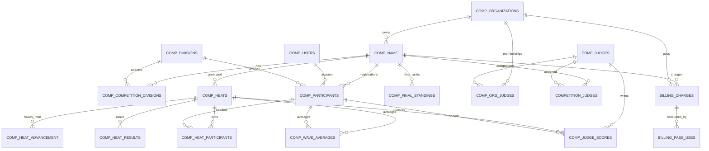

# Database Schema Notes

This document is inferred from controller/view SQL and README notes. There is no SurfPan domain `.sql` dump in the repository. Exact column types, indexes, constraints, default values, and seed rows need confirmation against the real database.

## Schema Sources Reviewed

| Source | Notes |
|---|---|
| `modules/competitions/controllers/Competitions.php` | Competition, participant, judge, score, average, and live heat SQL. |
| `modules/heats/controllers/Heats.php` | Bracket generation, heat participants, advancement, results, final standings. |
| `modules/heats/schedules/controllers/Schedules.php` | Schedule columns and status mutations. |
| `modules/judges/controllers/Judges.php` | Judge assignments, score inserts, missing score query. |
| `modules/users/controllers/Users.php` | Participant accounts, profiles, registration, public athlete ranking. |
| `modules/organizations/controllers/Organizations.php` | Organization records, timezone, logo, email confirmation. |
| `modules/billings/controllers/Billings.php` | Billing products, charges, subscriptions, event pass usage. |
| `modules/trongate_administrators/controllers/Trongate_administrators.php` | Admin reporting, impersonation audit log, billing overview. |
| `modules/welcome/views/database_setup.php` | Starter Trongate tables only. |

## Core Competition Tables

### `comp_name`

Purpose: master competition/event record.

Observed fields:

| Field | Observed Use |
|---|---|
| `id` | Primary key, route parameter, joins from heats/participants/billing. |
| `name`, `year`, `location` | Competition display and search. |
| `status` | Lifecycle: `created`, `open`, `closed`, `generated`, `running`, `finished`; admin also references `scheduled`, `archived`, `canceled`. |
| `organizer_id` | References `comp_organizations.id`. |
| `entry_type`, `entry_fee` | Free or paid participant entry flow. Naming is inconsistent (`free`, `fee`, `free entry`, `entry fee` appear in views/code). |
| `start_date`, `end_date` | Event dates, billing plan limits, listing order. |
| `created_at` | Used by billing/org dashboards. Needs confirmation. |
| `billing_charge_id` | Links to `billing_charges.id` for heat-generation payment. |
| `billing_status` | `pending`, `paid`, or unset. |
| `billing_tier` | Pricing tier snapshot such as `free_12`, `paid_24`, `event_pass`. |
| `billing_participants_locked` | Participant count used for the paid generation tier. |
| `timezone` | Read in legacy scoring path, but current code mostly gets timezone from organization. Needs confirmation whether this column exists or is obsolete. |

Key relationships:

| Relationship | Meaning |
|---|---|
| `comp_name.organizer_id -> comp_organizations.id` | Organizer owns competition. |
| `comp_participants.comp_id -> comp_name.id` | Registrations for competition. |
| `comp_heats.comp_id -> comp_name.id` | Generated heats. |
| `competition_judges.competition_id -> comp_name.id` | Judge assignments. |
| `billing_charges.comp_id -> comp_name.id` | Competition payment charge. |

### `comp_competition_divisions`

Purpose: join table from competition to selected divisions and elimination format.

Observed fields:

| Field | Observed Use |
|---|---|
| `id` | Used to update selected elimination format. |
| `competition_id` | References `comp_name.id`. |
| `division_id` | References `comp_divisions.id`. |
| `elimination_format` | Values used: `single`, `double`, `second_chance`, `robin`. Defaults to double in generation if missing. |

### `comp_divisions`

Purpose: catalog of surf divisions/categories.

Observed fields:

| Field | Observed Use |
|---|---|
| `id` | Primary key, selected in forms and participant records. |
| `name` | Human-readable division name; also copied into `comp_heats.division` and legacy `comp_participants.gender_age`. |
| `gender` | Used for participant eligibility filtering. |
| `age` | Used for participant eligibility filtering with values like `u12`, `adult`, `veteran`. Exact representation needs confirmation. |

### `comp_participants`

Purpose: participant registration record for a competition/division.

Observed fields:

| Field | Observed Use |
|---|---|
| `id` | Primary key; used as surfer id in heat participants, scores, results. |
| `comp_id` | References `comp_name.id`. |
| `user_id` | References `comp_users.id` for registered participant accounts. Can be null for manually created participants. |
| `division_id` | References `comp_divisions.id`. |
| `gender_age` | Legacy/display copy of division name. |
| `first_name`, `last_name`, `email` | Manual participant records and fallback display. |
| `status` | `pending`, `paid`, `confirmed`; generation only uses `confirmed`. |
| `billing_charge_id` | Links participant entry-fee charge. |

Needs confirmation:

| Issue | Detail |
|---|---|
| Status naming | Views compare entry type/status strings inconsistently. |
| Participant identity | Some joins treat `participant_id` as `comp_participants.id`, while old comments suggest `comp_users.id`. Current active scoring uses `comp_participants.id`. |

## Heat / Draw Tables

### `comp_heats`

Purpose: generated heat records and schedule/status state.

Observed fields:

| Field | Observed Use |
|---|---|
| `id` | Primary key. |
| `comp_id` | References `comp_name.id`. |
| `division` | Division name string copied from `comp_divisions.name`. |
| `round` | Round label such as `Round 1`, `Repechage`, `Semi Final`, `Final`. |
| `heat_number` | Heat number within round. |
| `status` | `pending`, `scheduled`, `running`, `finished`. |
| `start_time`, `end_time` | UTC SQL datetimes in current scheduling code. |
| `sort_order` | Schedule display and drag ordering. |
| `duration_min` | Optional per-heat duration for scheduling. |
| `is_locked` | Prevents auto-schedule/clear from changing locked heats. |

Needs confirmation: primary/foreign keys and whether default status is `pending` at insert. Generation inserts no explicit status.

### `comp_heat_participants`

Purpose: surfers seeded into heats with jersey colors.

Observed fields:

| Field | Observed Use |
|---|---|
| `heat_id` | References `comp_heats.id`. |
| `participant_id` | References `comp_participants.id`. |
| `jersey_color` | `white`, `red`, `green`, `blue`. |
| `seeded_from` | Previous `comp_heats.id` when surfer advances from another heat. Null for Round 1 seeds. |

Expected constraints:

| Constraint | Status |
|---|---|
| Unique `(heat_id, participant_id)` | Enforced manually in `_seed_into_heat()`; DB constraint needs confirmation. |
| Unique `(heat_id, jersey_color)` | Expected by UI/scoring; DB constraint needs confirmation. |

### `comp_heat_advancement`

Purpose: routing table that maps finish position in one heat to another heat or elimination.

Observed fields:

| Field | Observed Use |
|---|---|
| `from_heat_id` | Source heat. |
| `finish_position` | 1-based rank within source heat. |
| `to_heat_id` | Destination heat id; `NULL` means eliminated/no further route. |

Relationships:

| Relationship | Meaning |
|---|---|
| `from_heat_id -> comp_heats.id` | Source heat result. |
| `to_heat_id -> comp_heats.id` | Destination heat to seed if rank matches. |

## Scoring / Result Tables

### `comp_judge_scores`

Purpose: raw score from one judge for one participant wave.

Observed fields:

| Field | Observed Use |
|---|---|
| `id` | Score row id for edit modal. |
| `heat_id` | References `comp_heats.id`. |
| `judge_id` | References `comp_judges.id`. |
| `participant_id` | References `comp_participants.id`. |
| `score` | Numeric 0-10-ish score or `NULL` for missed wave. |
| `wave_number` | Per-judge sequence number for heat/participant. |

Needs confirmation:

| Issue | Detail |
|---|---|
| Numeric type | Should be decimal with enough precision for 0.1 and adjusted scores. |
| Uniqueness | App should likely enforce one score per judge/heat/participant/wave. DB constraint not visible. |
| Audit | No visible created/updated metadata in active code. |

### `comp_wave_averages`

Purpose: averaged wave score after aggregating judge scores.

Observed fields:

| Field | Observed Use |
|---|---|
| `id` | Used for update path. |
| `heat_id` | References `comp_heats.id`. |
| `wave_number` | Wave sequence. |
| `participant_id` | References `comp_participants.id`. |
| `avg_score` | Rounded average of non-null judge scores. |

Needs confirmation: a unique key on `(heat_id, wave_number, participant_id)` is implied by manual lookup and by older `ON DUPLICATE KEY UPDATE` code.

### `comp_heat_results`

Purpose: final result/rank for a participant in a heat.

Observed fields:

| Field | Observed Use |
|---|---|
| `heat_id` | References `comp_heats.id`. |
| `participant_id` | References `comp_participants.id`. |
| `total_score` | Sum of top two averaged waves. |
| `rank` | 1-based placement in heat. |

Behavior: `_save_heat_results()` deletes all rows for a heat then reinserts ranks.

### `comp_final_standings`

Purpose: final division standings once all seeded heats finish.

Observed fields:

| Field | Observed Use |
|---|---|
| `comp_id` | References `comp_name.id`. |
| `division` | Division name string. |
| `participant_id` | References `comp_participants.id`. |
| `final_score` | Best score from deepest relevant heat. |
| `rank` | Final standing. |

Behavior: `calculate_final_standings()` deletes rows for comp/division then reinserts.

## Judge / Organization Tables

### `comp_organizations`

Purpose: organization/organizer account and public org profile.

Observed fields:

| Field | Observed Use |
|---|---|
| `id` | Primary key and organizer id. |
| `organization` | Organization display name. |
| `name` | Person/name used by some organizer edit path. Needs confirmation. |
| `slug` | Public org URL. |
| `email`, `phone`, `address`, `country` | Profile/contact/login. |
| `status` | `inactive` until email confirmation, then `active`; admin can toggle. |
| `confirmed` | Email confirmation flag. |
| `timezone` | Organizer timezone for schedules. |
| `company_code` | Settings field. |
| `password` | Bcrypt hash for login. |
| `trongate_user_id` | References `trongate_users.id`. |
| `logo` | Uploaded logo file name. |
| `date_created`, `created_at` | Both names appear in code. Needs confirmation. |
| `instagram`, `facebook`, `youtube`, `tiktok` | Optional public links. Needs confirmation. |
| `num_logins`, `lockout_time`, `last_login` | Used by unified login if present. |

### `comp_org_accounts`

Purpose: additional organization account row created during organization signup.

Observed fields:

| Field | Observed Use |
|---|---|
| `organization_id`, `password`, `trongate_user_id`, `email`, `phone` | Inserted in `Organizations::submit_create()`. |

Needs confirmation: this table is created/inserted but not otherwise used in reviewed code.

### `comp_judges`

Purpose: judge account.

Observed fields:

| Field | Observed Use |
|---|---|
| `id` | Primary key and judge id. |
| `name`, `email`, `phone`, `username` | Profile/login/display. |
| `password` | Bcrypt hash. |
| `trongate_user_id` | References `trongate_users.id`. |
| `num_logins`, `lockout_time`, `last_login` | Used by unified login if present. |

Needs confirmation: active login searches by `email`; legacy competition login searches by `username`.

### `comp_org_judges`

Purpose: judge membership within an organization, with role and membership status.

Observed fields:

| Field | Observed Use |
|---|---|
| `id` | Membership id. |
| `user_id` | References `comp_judges.id`. |
| `organization_id` | References `comp_organizations.id`. |
| `role` | `judge` or `head_judge`. |
| `status` | `active`, `suspended`, maybe pending. |
| `invited_by` | Organizer id. |
| `created_at` | Display order/date. |

### `competition_judges`

Purpose: assigns organization judges to a specific competition.

Observed fields:

| Field | Observed Use |
|---|---|
| `id` | Assignment/invite id. |
| `judge_id` | References `comp_judges.id`. |
| `competition_id` | References `comp_name.id`. |
| `role` | Copied from `comp_org_judges.role`. |
| `status` | `pending invite`, `accepted`, `declined`, `active`. |

## Participant Account Tables

### `comp_users`

Purpose: participant account.

Observed fields:

| Field | Observed Use |
|---|---|
| `id` | Primary key. |
| `name`, `email`, `phone` | Login/profile/display. |
| `password` | Bcrypt hash. |
| `trongate_user_id` | References `trongate_users.id`. |
| `date_joined` | Signup timestamp. |
| `confirmed` | Email confirmation flag. |
| `num_logins`, `lockout_time`, `last_login` | Login throttling/audit fields. |

### `comp_users_profiles`

Purpose: participant profile metadata.

Observed fields:

| Field | Observed Use |
|---|---|
| `user_id` | References `comp_users.id`. |
| `dob` | Used to calculate age at end of year. |
| `gender` | Used for division eligibility. |
| `country` | References `countries.code`. |
| `club_name` | Public athlete profile/search. |
| `avatar` | Uploaded avatar file name. |

### `countries`

Purpose: country reference table.

Observed fields: `code`, `name`.

### `comp_roles` and `comp_users_roles`

Purpose: generic participant role helper functions exist in `Users.php`.

Observed fields:

| Table | Fields |
|---|---|
| `comp_roles` | `id`, `name` |
| `comp_users_roles` | `user_id`, `role_id` |

Needs confirmation: these helper roles are not the main organizer/judge/head-judge permission model.

## Billing Tables

### `billing_products`

Purpose: product/plan definitions.

Observed fields:

| Field | Observed Use |
|---|---|
| `id` | Linked by `billing_charges.product_id`. |
| `code` | Pricing tier lookup, e.g. `free_12`, `paid_24`, `starter_free`, `event_pass`. |
| `name` | Admin billing overview display. |
| `price` | Charge amount. |
| `active` | Product lookup filter. |
| `period_months` | Subscription plan helper. |
| `features_json` | Subscription feature limits. |

### `billing_charges`

Purpose: one-off payment/order records.

Observed fields:

| Field | Observed Use |
|---|---|
| `id` | Charge/order id. |
| `organizer_id` | Organization charge owner for competition generation or event pass. |
| `user_id` | Entry-fee participant id in `entry_pay_modal()`. |
| `comp_id` | Competition id for generation payment. |
| `product_id` | Product id; `6` used for event pass, `11` used for entry fee. |
| `amount`, `currency` | Payment amount. |
| `participants_count` | Snapshot for generation tier. |
| `status` | `pending`, `paid`, `failed`. |
| `payment_ref` | EveryPay payment reference. |
| `paid_at` | Paid timestamp. |
| `quantity` | Event pass quantity. |
| `provider` | Manual grants use `manual`. |
| `product_code` | Used by one helper, while other code uses `product_id`. Needs confirmation/fix. |

### `billing_subscriptions`

Purpose: subscription plan records.

Observed fields:

| Field | Observed Use |
|---|---|
| `id` | Subscription id. |
| `organization_id` | References organization. |
| `product_code` | Links to `billing_products.code`. |
| `status` | `trialing`, `active`, `past_due`. |
| `current_period_start`, `current_period_end` | Active/grace period checks. |
| `period_months` | Period snapshot. |
| `meta_json` | Organization helper returns it. |

### `billing_pass_uses`

Purpose: event-pass credit usage log.

Observed fields:

| Field | Observed Use |
|---|---|
| `id` | Primary key. |
| `organization_id` | Organization using credit. |
| `charge_id` | References event-pass `billing_charges.id`. |
| `competition_id` | Competition that consumed credit. |
| `used_by_account` | Optional user/account id. |

## Auth / Framework Tables

Starter SQL is embedded in `modules/welcome/views/database_setup.php`.

| Table | Purpose | Key Fields |
|---|---|---|
| `trongate_users` | Core identity row. | `id`, `code`, `user_level_id` |
| `trongate_user_levels` | User level labels. | `id`, `level_title` |
| `trongate_tokens` | Auth tokens. | `id`, `token`, `user_id`, `expiry_date`, `code` |
| `trongate_administrators` | Admin credentials. | `id`, `username`, `password`, `trongate_user_id` |
| `trongate_comments` | Framework comments. | `id`, `comment`, `date_created`, `user_id`, `target_table`, `update_id`, `code` |
| `admin_audit_log` | Admin impersonation audit. | `admin_id`, `action`, `target_id`, `note`, `ip`, `created_at` |

User level mapping inferred from code:

| Level ID | Role |
|---:|---|
| `1` | admin |
| `3` | judge/head judge |
| `4` | organizer |
| `5` | participant |

Needs confirmation: seed rows for levels `3`, `4`, and `5` are not present in the starter SQL page.

## Mermaid ER Diagram

## Schema Gaps To Confirm

| Gap | Why It Matters |
|---|---|
| Full create-table definitions | Required for local setup and safe migrations. |
| Foreign keys and unique keys | Critical for avoiding duplicate heat participants, duplicate judge scores, and orphaned records. |
| Seed data for user levels/divisions/products | Required for onboarding a developer. |
| Status enum/value list | Current code compares many strings; mismatches can break lifecycle. |
| Time storage invariant | Existing rows should be confirmed as UTC before refactoring. |
| Billing product ids | Code assumes event pass `6` and entry fee `11`; should be data-driven. |

