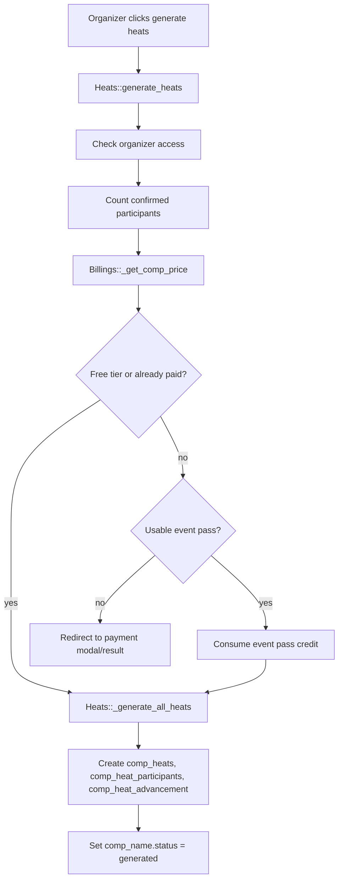
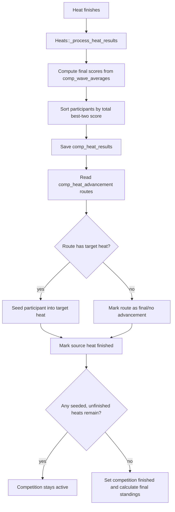

# Heat Generation Logic

Last reviewed: 2026-05-24

This document describes the heat-generation implementation found in `modules/heats/controllers/Heats.php` and the billing gate in `modules/competitions/controllers/Competitions.php` and `modules/billings/controllers/Billings.php`.

No production data was queried. Exact table constraints and historical generated draws need confirmation from the live database.

## Primary Source Files

| File | Responsibility |
|---|---|
| `modules/heats/controllers/Heats.php:230` | `generate_heats()` public entry point and billing gate handoff. |
| `modules/heats/controllers/Heats.php:1668` | `_generate_all_heats()` core generation orchestration. |
| `modules/heats/controllers/Heats.php:935` | `_generate_double_elimination_bracket()`. |
| `modules/heats/controllers/Heats.php:1206` | `_generate_single_elimination_bracket()`. |
| `modules/heats/controllers/Heats.php:1444` | `_generate_second_chance_bracket()`. |
| `modules/heats/controllers/Heats.php:1793` | `_process_heat_results()` advancement after a heat finishes. |
| `modules/heats/controllers/Heats.php:1900` | `_seed_into_heat()` inserts advancing participants into downstream heats. |
| `modules/heats/controllers/Heats.php:1948` | `_save_heat_results()` persists heat rankings. |
| `modules/heats/controllers/Heats.php:1973` | `_get_final_scores()` computes two-best-wave totals for a heat. |
| `modules/heats/views/heats_generate.php` | Organizer UI for choosing division elimination formats. |

## Generation Preconditions

Heat generation runs per competition, not per division.

The core generator requires:

| Requirement | Code Behavior |
|---|---|
| Authenticated organizer | `_generate_all_heats()` calls `$this->module('trongate_security')->_make_sure_allowed('organizers area')`. |
| Competition exists | Loads `comp_name` by `id`. |
| Competition status is `closed` | If status is not `closed`, generation aborts with a flash error. |
| Competition has selected divisions | Reads `comp_competition_divisions` joined to `comp_divisions`. |
| Each generated division has at least two confirmed participants | Reads `comp_participants` where `status = 'confirmed'`; divisions with fewer than two competitors are skipped with an error. |
| Billing is cleared | `generate_heats()` can require an EveryPay payment or event-pass credit before calling `_generate_all_heats()`. |

Needs confirmation: what UI action changes a competition from `open` to `closed` in production workflow, and whether organizers are expected to manually close registration before generating heats.

## Public Entry Flow



## Billing Gate

`Heats::generate_heats()` loads the billing module and calls `Billings::_get_comp_price($participant_count)`.

Observed behavior:

| Condition | Behavior |
|---|---|
| `comp_name.billing_status = 'paid'` | Generation proceeds. |
| Computed tier price is `0` | Generation proceeds. |
| Product is event-pass tier and a pass credit is available | `Billings::_consume_event_pass_credit()` is called, then generation proceeds. |
| Payment required | `billing_participants_locked`, `billing_tier`, and `billing_status = 'pending'` are stored on `comp_name`, then user is routed through billing. |

Implementation warning: several billing helper methods appear to have naming/signature bugs. See `DEVELOPER_TODO.md`.

## Division Selection And Elimination Format

Competition divisions are stored in `comp_competition_divisions`. Generation reads:

```sql
SELECT ccd.*, d.name AS division_name
FROM comp_competition_divisions ccd
JOIN comp_divisions d ON d.id = ccd.division_id
WHERE ccd.competition_id = ?
```

For each division, generation reads confirmed participants:

```sql
SELECT *
FROM comp_participants
WHERE comp_id = ?
AND division_id = ?
AND status = 'confirmed'
```

`elimination_format` values observed:

| Value | Meaning | Implemented? |
|---|---|---|
| `double` | Double-elimination style with winner path and repechage path. | Yes. |
| `single` | Single-elimination path. | Yes. |
| `second_chance` | First-round losers get one repechage path, then merge back. | Yes. |
| `robin` | Round robin. | No generator implemented. UI/code references exist, but `_generate_all_heats()` records an error. |

If `elimination_format` is missing, generation defaults to `double`.

## Shared Generation Concepts

### Shuffling And Seeding

Participants are shuffled before each division bracket is generated:

```php
shuffle($participants);
```

Round 1 participants are distributed by index modulo the number of first-round heats. This spreads shuffled participants across the opening heats.

Needs confirmation: whether SurfPan requires ranked seeding from earlier events or random seeding is the intended rule.

### Jersey Colors

Initial and advancement seeding uses this color order:

```text
white, red, green, blue
```

`_seed_into_heat()` chooses the first unused jersey color in the target heat. If all colors are already used, it logs an overfull warning.

Needs confirmation: whether heats may ever have more than four surfers. Most generated final routes assume four places.

### Heat Tables Written

| Table | Generation Use |
|---|---|
| `comp_heats` | One row per generated heat. Stores competition, division, round, heat number, status, scheduled times, and ordering. |
| `comp_heat_participants` | Competitor slots in heats, with jersey color and optional source metadata. |
| `comp_heat_advancement` | Route rules mapping finish positions in a source heat to target heats. |

## Status Changes

Generation sets `comp_name.status = 'generated'` at the end of `_generate_all_heats()`.

Important behavior: `_generate_all_heats()` can collect errors for individual divisions but still marks the competition as `generated`. This can create partially generated competitions. Whether that is intended needs confirmation.

## Double Elimination

Implemented in `Heats::_generate_double_elimination_bracket()`.

The code creates a winner path and a repechage path. Winner-path losers route into repechage if a matching repechage round exists. Finalists come from the last winner-path stage and the last repechage stage.

### Double-Elimination Plan By Division Size

| Participants | Winner Path | Repechage Path | Final Routing |
|---|---|---|---|
| 2-4 | Round 1: 1 heat, advance 4 | None | Round 1 feeds final. |
| 5-6 | Round 1: 2 heats, advance 1 each | Repechage 1: 1 heat, advance 2 | Winner path and repechage feed final. |
| 7-8 | Round 1: 2 heats, advance 2; Round 2: 1 heat, advance 2 | Repechage 1: 1 heat, advance 2; Repechage 2: 1 heat, advance 2 | Final combines last winner/repechage advancers. |
| 9 | Round 1: 3 heats, advance 2; Round 2: 2 heats, advance 1 | Repechage 1: 1 heat, advance 2; Repechage 2: 2 heats, advance 1 | Final combines last winner/repechage advancers. |
| 10-12 | Round 1: 4 heats, advance 1; Round 2: 1 heat, advance 2 | Repechage 1: 2 heats, advance 2; Repechage 2: 2 heats, advance 1 | Final combines last winner/repechage advancers. |
| 13-16 | Round 1: 4 heats, advance 2; Round 2: 2 heats, advance 2; Semi Final: 1 heat, advance 2 | Repechage 1: 2 heats, advance 2; Repechage 2: 1 heat, advance 2 | Final combines last winner/repechage advancers. |
| 17-20 | Round 1: 5 heats, advance 2; Round 2: 3 heats, advance 2; Semi Final: 2 heats, advance 1 | Repechage 1: 3 heats, advance 2; Repechage 2: 2 heats, advance 2; Repechage 3: 1 heat, advance 2 | Final combines last winner/repechage advancers. |
| 21-24 | Round 1: 6 heats, advance 2; Round 2: 3 heats, advance 2; Semi Final: 2 heats, advance 1 | Repechage 1: 3 heats, advance 2; Repechage 2: 2 heats, advance 2; Repechage 3: 1 heat, advance 2 | Final combines last winner/repechage advancers. |
| 25-36 | Round 1: 9 heats, advance 2; Round 2: 6 heats, advance 2; Quarter Final: 3 heats, advance 2; Semi Final: 2 heats, advance 1 | Repechage 1: 6 heats, advance 2; Repechage 2: 3 heats, advance 2; Repechage 3: 2 heats, advance 2; Repechage 4: 1 heat, advance 2 | Final combines last winner/repechage advancers. |

Needs confirmation: divisions larger than 36 are not handled by a dedicated plan. The helper estimate has a fallback, but the actual double-elimination bracket config shown above stops at 36.

### Double-Elimination Advancement

`comp_heat_advancement` rows are created for each source heat and finish position.

General pattern:

| Finish Position | Route |
|---|---|
| Winner-path qualifying places | Next winner-path round, or final from last stage. |
| Winner-path non-qualifying places | Matching repechage heat if available; otherwise eliminated. |
| Repechage qualifying places | Next repechage round, or final from last stage. |
| Repechage non-qualifying places | Eliminated. |
| Final positions 1-4 | No target heat. |

## Single Elimination

Implemented in `Heats::_generate_single_elimination_bracket()`.

Losers are eliminated immediately. Advancers route to the next winner-path round.

### Single-Elimination Plan By Division Size

| Participants | Plan |
|---|---|
| 2-4 | Final only, one heat, advance 4. |
| 5-6 | Round 1: 2 heats, advance 2 each; Final. |
| 7-8 | Round 1: 2 heats, advance 2 each; Final. |
| 9-12 | Round 1: 3 heats, advance 2 each; Semi Final: 2 heats, advance 2 each; Final. |
| 13-16 | Round 1: 4 heats, advance 2 each; Semi Final: 2 heats, advance 2 each; Final. |
| 17-24 | Round 1: 6 heats, advance 2 each; Quarter Final: 3 heats, advance 2 each; Semi Final: 2 heats, advance 2 each; Final. |
| 25-32 | Round 1: 8 heats, advance 2 each; Quarter Final: 4 heats, advance 2 each; Semi Final: 2 heats, advance 2 each; Final. |
| 33-36 | Round 1: 9 heats, advance 2 each; Round 2: 5 heats, advance 2 each; Quarter Final: 3 heats, advance 2 each; Semi Final: 2 heats, advance 2 each; Final. |

Implementation warning: the single-elimination final appears to insert only one no-target advancement route for position 1, unlike double elimination and second chance which insert final routes for positions 1-4. This may affect final result processing or display. Needs confirmation with live behavior.

## Second Chance

Implemented in `Heats::_generate_second_chance_bracket()`.

Second chance is different from full double elimination:

1. Opening-round qualifiers continue on the winner path.
2. Opening-round non-qualifiers get one repechage opportunity.
3. Repechage qualifiers merge back into the main path.
4. Later non-qualifiers are eliminated.

### Second-Chance Plan By Division Size

| Participants | Plan |
|---|---|
| 2-4 | Round 1: 1 heat, advance 2; Repechage: 1 heat, up to 4 surfers, advance 2; Final. |
| 5-6 | Round 1: 2 heats, advance 1 each; Repechage: 1 heat, up to 4 surfers, advance 2; Final. |
| 7-8 | Round 1: 2 heats, advance 2 each; Repechage: 1 heat, advance 2; Round 2: 2 heats, advance 2 each; Final. |
| 9-12 | Round 1: 3 heats, advance 2 each; Repechage: 2 heats, up to 3 surfers each, advance 1; Round 2: 2 heats, advance 2 each; Final. |
| 13-16 | Round 1: 4 heats, advance 2 each; Repechage: 2 heats, up to 4 surfers each, advance 1; Round 2: 3 heats, advance 2 each; Semi Final: 2 heats, advance 2 each; Final. |
| 17-24 | Round 1: 6 heats, advance 2 each; Repechage: 4 heats, up to 3 surfers each, advance 1; Round 2: 4 heats, advance 2 each; Semi Final: 2 heats, advance 2 each; Final. |
| 25-36 | Round 1: 9 heats, advance 2 each; Repechage: 6 heats, up to 3 surfers each, advance 1; Round 2: 6 heats, advance 2 each; Quarter Final: 3 heats, advance 2 each; Semi Final: 2 heats, advance 2 each; Final. |

Needs confirmation: exact intended semantics of "second chance" for 2-4 surfer divisions. The code creates a repechage even though a four-surfer final could already include all competitors.

## Round Robin

Round robin is referenced but not implemented.

Observed code:

| Location | Behavior |
|---|---|
| `Heats::heats_for_round_robin()` | Helper returns estimated heat count equal to participant count. |
| `Heats::_get_elim_plan()` | Includes `robin` display label and disabled-style metadata. |
| `Heats::_generate_all_heats()` | Adds an error: round robin generation is not implemented. |

Needs confirmation: whether round robin is planned, deprecated, or should be removed from the UI.

## Heat Result Processing And Advancement

Heat completion is handled by `Heats::_process_heat_results($heat_id)`.

Flow:



Important details:

| Behavior | Notes |
|---|---|
| Reprocessing finished heats | If a heat is already `finished`, `_process_heat_results()` recalculates and saves heat results but does not reseed downstream heats. |
| Duplicate prevention | `_seed_into_heat()` checks whether the participant already exists in the target heat. |
| Jersey assignment on advancement | `_seed_into_heat()` assigns the first unused color from `white`, `red`, `green`, `blue`. |
| Final competition completion | If no seeded unfinished heats remain, the competition is marked `finished` and final standings are calculated. |

## Regeneration And Wiping Existing Draws

Generation deletion/regeneration paths call `_wipe_generation($comp_id)`.

The wipe deletes:

| Table | Delete Scope |
|---|---|
| `comp_heat_results` | Results for heats in the competition. |
| `comp_heat_participants` | Participants for heats in the competition. |
| `comp_heat_advancement` | Routes where source or target heat belongs to the competition. |
| `comp_heats` | Heats for the competition. |
| `comp_final_standings` | Final standings for the competition. |

It then resets `comp_name.status = 'closed'`.

Important gap: `_wipe_generation()` does not delete `comp_judge_scores` or `comp_wave_averages`. Old scores/averages may remain orphaned after draw deletion. There is another method named `_remove_all_heat_data()` that attempts broader cleanup, but it references an undefined `$comp` variable and overrides its parameter with `segment(3)`, so it should be treated as unsafe until fixed.

## Heat Count Helper Methods

The controller has helper methods used for UI estimates:

| Method | Purpose |
|---|---|
| `heats_for_double($n)` | Estimated double-elimination heat count. |
| `heats_for_single($n)` | Estimated single-elimination heat count. |
| `heats_for_round_robin($n)` | Estimated round-robin heat count. |
| `heats_for_second_chance($n)` | Estimated second-chance heat count. |

These helper counts do not fully document the actual generated bracket. The actual source of truth is the `_generate_*_bracket()` method for each format.

## Known Risks And Technical Debt

| Area | Risk |
|---|---|
| Partial generation | Competition can be marked `generated` even if one or more divisions fail. |
| Round robin | UI/code references exist but generation is not implemented. |
| Single final routes | Single-elimination final appears to create only a position-1 no-target route. |
| Regeneration cleanup | Judge score and wave average rows are not deleted by the main wipe method. |
| Random seeding | `shuffle()` gives no reproducible seed/audit trail. |
| No tests | Bracket plans and advancement routing are not covered by automated tests in the repository. |
| Hardcoded size bands | Divisions above 36 participants are not clearly supported by actual bracket configs. |
| Schedule reorder coupling | `Schedules::reorder()` has a round-name rank map that does not cover every generated round label. |

## Recommended Next Steps

1. Extract bracket generation into a pure service class that returns a bracket plan before writing to the database.
2. Add fixture tests for participant counts 2 through 36 for `single`, `double`, and `second_chance`.
3. Define expected behavior for divisions over 36 participants.
4. Decide whether round robin should be implemented or removed.
5. Make generation transactional per competition.
6. Prevent competition status from becoming `generated` when any selected division fails generation.
7. Fix regeneration cleanup so score and average rows are either deleted or intentionally archived.
8. Add a deterministic seeding option or record the shuffled seed order for auditability.
