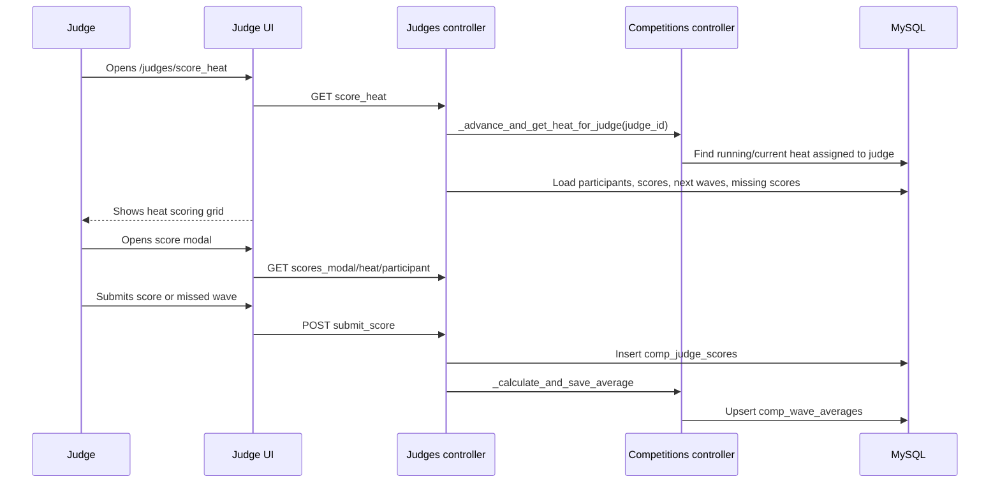

# Scoring System

Last reviewed: 2026-05-24

This document describes how judges submit wave scores, how averages and heat rankings are calculated, and where the current implementation has gaps.

No production data was queried. Surfing competition tie-break rules and head-judge override policy need confirmation from product/operations.

## Primary Source Files

| File | Responsibility |
|---|---|
| `modules/judges/controllers/Judges.php:374` | Active judge scoring page. |
| `modules/judges/controllers/Judges.php:471` | Score modal for a participant/wave. |
| `modules/judges/controllers/Judges.php:513` | Active score submission endpoint. |
| `modules/judges/controllers/Judges.php:569` | Missing-score detection for a judge. |
| `modules/judges/views/scoring.php` | Judge scoring UI, countdown, score table, missing-score buttons. |
| `modules/judges/views/score_modal.php` | Score input modal, missed-wave control, mobile buttons. |
| `modules/competitions/controllers/Competitions.php:234` | `_calculate_and_save_average()`. |
| `modules/competitions/controllers/Competitions.php:368` | `_get_next_wave()`. |
| `modules/competitions/controllers/Competitions.php:387` | `_advance_and_get_heat_for_judge()`. |
| `modules/competitions/controllers/Competitions.php:1490` | Head-judge all-scores view. |
| `modules/competitions/controllers/Competitions.php:1645` | Head-judge score edit submission. |
| `modules/heats/controllers/Heats.php:1793` | Heat result processing and advancement. |
| `modules/heats/controllers/Heats.php:1973` | Heat score totals from best two waves. |

## Active Scoring Flow



There is an older scoring flow in `modules/competitions/controllers/Competitions.php:112` and `modules/competitions/controllers/Competitions.php:183`. The code comments mark it as deprecated. The active judge UI uses `modules/judges/controllers/Judges.php`.

## Score Submission

Active endpoint: `POST /judges/submit_score`.

Observed POST fields:

| Field | Meaning |
|---|---|
| `heat_id` | Heat being scored. |
| `participant_id` | Participant/surfer being scored. |
| `score` | Numeric score or `M` for missed wave. |
| `adjustment` | Optional decimal adjustment, usually from mobile half-point controls. |

The controller:

1. Verifies judge access through `trongate_security` using the `judges area` scenario.
2. Resolves the current judge row from the logged-in token.
3. Calculates the next wave number for the judge/participant/heat.
4. Stores one row in `comp_judge_scores`.
5. Recalculates the average for that heat/participant/wave.
6. Returns the judge to the scoring page.

## Score Normalization

`Judges::submit_score()` treats `score = 'M'` as a missed wave and stores `NULL` in `comp_judge_scores.score`.

For numeric scores:

```php
$score = max(0, min(10, (float) $score));
$score = round($score + $adjustment, 2);
```

Important bug risk: the adjustment is added after clamping, so a submitted `10` with `+0.5` can become `10.5`, and a submitted `0` with `-0.5` can become `-0.5`. The final adjusted score should probably be clamped again to `0..10`.

Needs confirmation: whether decimal increments should be restricted to 0.1, 0.25, 0.5, or another judging standard.

## Wave Number Assignment

Wave numbers come from `Competitions::_get_next_wave($heat_id, $participant_id, $judge_id)`:

```sql
SELECT COALESCE(MAX(wave_number), 0) + 1 AS next_wave
FROM comp_judge_scores
WHERE heat_id = ?
AND participant_id = ?
AND judge_id = ?
```

This means wave numbers are assigned per judge, not globally per surfer.

Implications:

| Scenario | Effect |
|---|---|
| All judges score every wave in order | Wave numbers align. |
| A judge misses a wave but records it as `M` | Wave numbers remain aligned because a row exists. |
| A judge fails to submit anything for a wave | The next numeric submission can be assigned the wrong wave number relative to other judges. |

Missing-score detection tries to identify waves scored by other judges but missing from the current judge. This only works if judges actively use the missing-score UI before scoring later waves.

Needs confirmation: intended official policy for assigning wave numbers. A more robust model would create global participant wave rows and attach judge scores to those rows.

## Judge Score Table

Observed fields in `comp_judge_scores`:

| Field | Meaning |
|---|---|
| `id` | Score row id. |
| `heat_id` | Heat being scored. |
| `participant_id` | Participant/surfer. |
| `judge_id` | Judge who submitted. |
| `wave_number` | Per-judge wave sequence. |
| `score` | Numeric score or `NULL` for missed wave. |
| `created_at` | Insert timestamp. |
| `updated_at` | Updated by head-judge edit flow. |

## Average Calculation

`Competitions::_calculate_and_save_average($heat_id, $participant_id, $wave_number)` reads all numeric judge scores for the same heat, participant, and wave:

```sql
SELECT AVG(score) AS average_score, COUNT(*) AS total_judges
FROM comp_judge_scores
WHERE heat_id = ?
AND participant_id = ?
AND wave_number = ?
AND score IS NOT NULL
```

Behavior:

| Condition | Average Row |
|---|---|
| One or more numeric scores exist | Average is rounded to 2 decimals. |
| All rows are missed waves or no numeric scores exist | Average is stored as `0`. |
| Average row exists | Updates `average_score` and `total_judges`. |
| Average row does not exist | Inserts a row in `comp_wave_averages`. |

Observed fields in `comp_wave_averages`:

| Field | Meaning |
|---|---|
| `id` | Average row id. |
| `heat_id` | Heat. |
| `participant_id` | Participant. |
| `wave_number` | Wave number. |
| `average_score` | Average of non-null judge scores. |
| `total_judges` | Count of non-null judge scores included. |
| `updated_at` | Update timestamp. |

Needs confirmation: whether missed waves should count as `0` in the average denominator or be excluded as implemented.

## Best Two Waves And Heat Ranking

`Heats::_get_final_scores($heat_id)` computes heat totals from `comp_wave_averages`.

Algorithm:

1. Load heat participants.
2. Load all average wave rows for those participants.
3. Group averages by participant.
4. Sort each participant's waves descending by `average_score`.
5. Take the top two waves.
6. Sum the top two averages to get `total_score`.
7. Sort participants descending by `total_score`.

Stored heat results are written by `_save_heat_results()` to `comp_heat_results`.

Observed result fields:

| Field | Meaning |
|---|---|
| `heat_id` | Heat. |
| `participant_id` | Participant. |
| `rank` | Finish position in the heat. |
| `total_score` | Sum of best two average waves. |
| `best_waves` | JSON of the selected waves/scores. |

## Tie Handling

No explicit surf tie-break rule was found.

Current behavior:

| Location | Observed Tie Behavior |
|---|---|
| `Heats::_get_final_scores()` | Sorts by `total_score` descending. Equal totals keep PHP sort behavior; no deterministic secondary rule is visible. |
| `Heats::calculate_final_standings()` | Sorts by round priority, final rank, then total score. No best-wave tie-breaker is visible. |
| Score displays | No tie-break explanation was found in views. |

Needs confirmation: official tie-break order. Common possibilities include best single wave, third best wave, highest individual judge score, head-judge decision, or manual override.

## Missing Scores

`Judges::_get_missing_score($heat_id, $participant_id, $judge_id)` finds waves for a participant/heat that have at least one score from another judge and no score from the current judge.

The scoring UI shows missing-score buttons so a judge can submit the missing wave.

Limitations:

| Limitation | Impact |
|---|---|
| Depends on wave number alignment | If the current judge has later submissions with shifted wave numbers, the UI can become confusing. |
| No explicit global wave row | The system infers waves from judge submissions. |
| No audit trail for why a score is missing | Needs confirmation whether this is acceptable for competition records. |

## Judge Edits And Head Judge Review

Head-judge review routes are in `Competitions.php`.

| Route/Method | Purpose |
|---|---|
| `Competitions::all_scores()` | Shows scores, requiring the logged-in judge to be assigned with `competition_judges.role = 'head_judge'` for the heat's competition. |
| `Competitions::edit_scores()` | Edit-oriented score table. |
| `Competitions::edit_score_modal()` | Modal for editing one score. |
| `Competitions::submit_edit_score()` | Validates and updates one `comp_judge_scores` row, then recalculates the wave average. |

Edit behavior:

| Behavior | Notes |
|---|---|
| Numeric validation | Edited score must be numeric and between 0 and 10. |
| Average recalculation | `_calculate_and_save_average()` is called after edit. |
| Result reprocessing | The method intentionally does not call `_process_heat_results()` automatically because that would mark the heat finished or affect advancement. |
| Audit trail | No separate score-edit audit table was found. Only `updated_at` is changed. |

Needs confirmation: whether score edits should be permitted after heat advancement, and whether edits should trigger recalculation of heat results/final standings.

## Heat Completion

Heat status changes are handled in:

| File | Behavior |
|---|---|
| `modules/competitions/controllers/Competitions.php:325` | `update_heat_status()` updates heat status and can process results on finish. |
| `modules/heats/controllers/Heats.php:1793` | `_process_heat_results()` saves results, advances surfers, and can finish competition. |
| `modules/judges/views/scoring.php` | Countdown UI based on heat end time. |

Needs confirmation: whether heat finishing is manually triggered, automatically triggered by countdown, or both. The UI has countdown behavior, but the authoritative status transition is server-side.

## Frontend Scoring Behavior

Observed UI behavior:

| View/File | Behavior |
|---|---|
| `modules/judges/views/scoring.php` | Shows heat metadata, countdown from `data-end-time`, participant score panels, next-wave buttons, missing-score buttons, and final/old score tables. |
| `modules/judges/views/score_modal.php` | Uses range/radio controls for scores, a missed-wave checkbox, mobile score buttons, and adjustment controls. |
| `public/js/app.js` | General frontend behaviors and Trongate MX support. |
| `public/js/trongate-mx.js` | Server-driven modal/AJAX interaction layer. |

Needs confirmation: whether live score pages poll automatically for fresh `comp_wave_averages`, or whether score updates require page refresh in the current production UI.

## Known Risks And Technical Debt

| Area | Risk |
|---|---|
| Wave numbering | Per-judge numbering can misalign when a judge misses a submission. |
| Score clamp | Adjustment can push score outside `0..10`. |
| Tie-breaks | No explicit deterministic competition tie rules found. |
| Missing scores | Missing waves are inferred, not modeled. |
| Head-judge edits | No separate audit log or reprocessing policy found. |
| Deprecated scoring path | Old `Competitions::score_submit()` remains and uses different field conventions. |
| Result consistency | Editing a score after advancement may leave heat results/final standings stale unless manually recalculated. |
| Test coverage | No automated scoring tests found. |

## Recommended Refactor

1. Introduce a `comp_waves` table or equivalent domain model so each participant wave is global and judge scores attach to it.
2. Clamp adjusted scores after applying the adjustment.
3. Define and implement official tie-break rules.
4. Add score-edit audit logging with old score, new score, editor, reason, and timestamp.
5. Extract scoring math into a testable service.
6. Add tests for missed waves, all-missed waves, partial judge coverage, ties, and score edits.
7. Decide whether recalculation after head-judge edits should update only averages, heat results, downstream advancement, final standings, or require manual confirmation.
