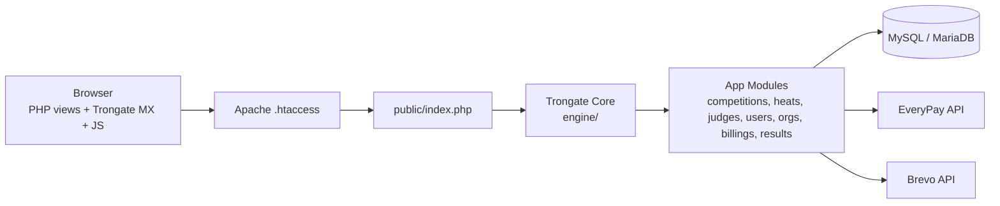
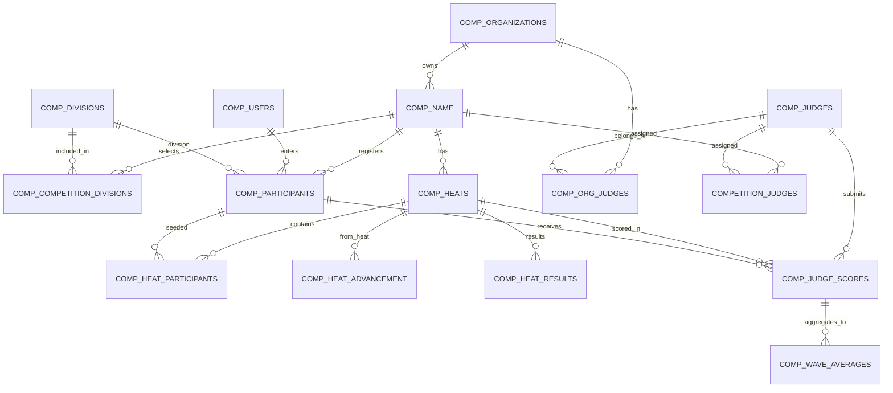
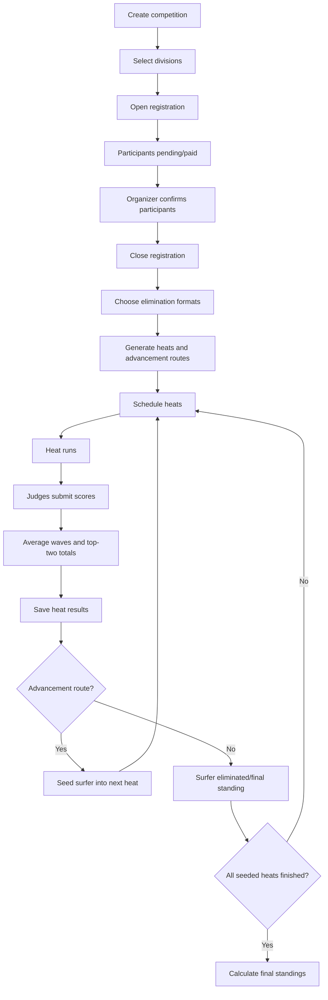
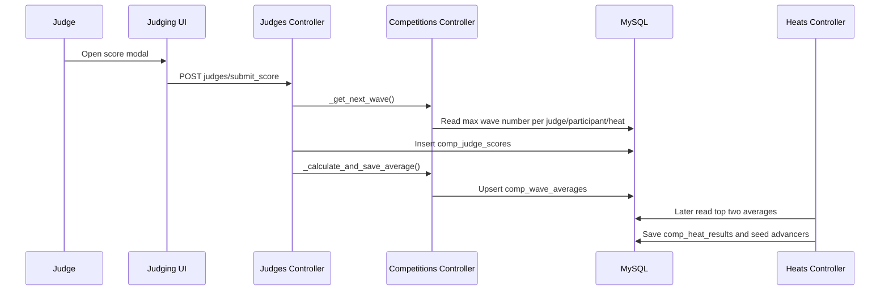
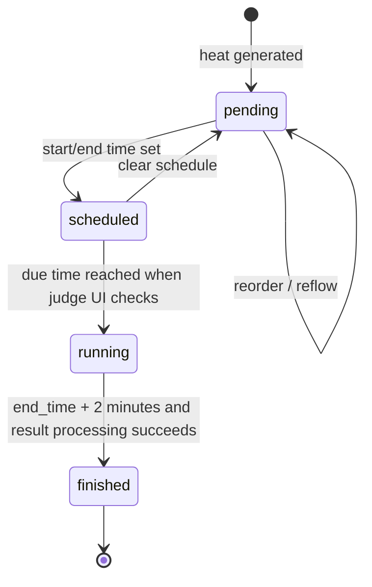

# SurfPan Codebase Handover

Last reviewed: 2026-05-24  
Repository root: `/Applications/XAMPP/xamppfiles/htdocs/surfpan`

## Scope And Caveats

This handover is based on the checked-in code, views, JavaScript, configuration, and README. No production database was queried and no full SurfPan SQL dump exists in the repository. Exact column types, indexes, foreign keys, seed data, and live credentials therefore need confirmation from the database owner.

Important: `config/config.php` and `config/database.php` contain hardcoded live-looking API/database credentials. They are not repeated in this document.

## Related Documents

| File | Purpose |
|---|---|
| [DATABASE_SCHEMA.md](DATABASE_SCHEMA.md) | Table-by-table database notes inferred from code. |
| [HEAT_GENERATION_LOGIC.md](HEAT_GENERATION_LOGIC.md) | Bracket generation rules, elimination formats, and advancement. |
| [SCORING_SYSTEM.md](SCORING_SYSTEM.md) | Judge score submission, averages, rankings, ties, and edits. |
| [AUTH_AND_PERMISSIONS.md](AUTH_AND_PERMISSIONS.md) | Login flows, token model, user levels, ownership checks, and risks. |
| [API_ENDPOINTS.md](API_ENDPOINTS.md) | Important routes/endpoints and expected behavior. |
| [DEVELOPER_TODO.md](DEVELOPER_TODO.md) | Technical debt and recommended refactor plan. |

## 1. Project Overview

SurfPan is a surf competition management and live judging system. Organizers create competitions, select divisions, register or approve participants, choose an elimination format per division, generate heats, schedule heat times, assign judges, collect wave scores, calculate heat rankings, advance surfers through the draw, and publish final results.

The app supports public pages for organizers, athletes, heat draws, and results; authenticated organizer/judge dashboards; participant accounts; billing through EveryPay; transactional email through Brevo; and an admin panel for platform operators.

Primary implementation lives in Trongate HAVC modules under `modules/`, with client behavior handled by Trongate MX attributes, plain JavaScript, and PHP-rendered views.

## 2. Tech Stack

| Layer | Details |
|---|---|
| Framework | Trongate PHP framework v1 style, custom HAVC modules. Core in `engine/`. |
| Backend language | PHP 8+ required by `match`, typed properties, nullable/union return types, and arrow functions. |
| Database | MySQL/MariaDB. Queries use Trongate model helpers and raw SQL. Exact schema needs confirmation. |
| Frontend | PHP views, Trongate MX (`public/js/trongate-mx.js`), plain JavaScript (`public/js/app.js`, `public/js/drag.js`), CSS in `public/css/`. |
| Auth | Trongate token table/session/cookie handling via `modules/trongate_tokens/controllers/Trongate_tokens.php`; custom users in `comp_users`, `comp_organizations`, and `comp_judges`. |
| Payments | EveryPay one-off payment API in `modules/billings/controllers/Billings.php:423`. |
| Email | Brevo transactional API in `modules/users/controllers/Users.php:814` and `modules/organizations/controllers/Organizations.php:543`. `Welcome::submit_form()` also uses native `mail()`. |
| Uploads | Trongate image/file helpers for participant avatars and organization logos. |
| Hosting assumptions | Apache with rewrite rules. Root `.htaccess` forwards to `public/`; `public/.htaccess` routes to `public/index.php`. README assumes XAMPP local development. |
| Other dependencies | No PHP `composer.json`. A separate `remotion/` React/Remotion project exists for videos and appears separate from the PHP app runtime. |

## 3. Folder And Module Structure

| Path | Purpose |
|---|---|
| `config/` | Application config, database constants, custom routes, admin theme, site owner details. |
| `engine/` | Trongate core framework. Should not be edited for app work unless intentionally changing framework behavior. |
| `modules/competitions/` | Competition creation/editing, participant management, legacy judge scoring, judge account management, live heat status, score editing. Main controller: `Competitions.php`. |
| `modules/heats/` | Heat generation, heat draw display, heat scheduling pages, result processing, advancement, final standings. Main controller: `Heats.php`. |
| `modules/heats/schedules/` | Nested schedule API for clear, reorder, auto schedule, set time, and reflow. Main controller: `Schedules.php`. |
| `modules/judges/` | Judge dashboard, invitations, assigning/removing judges, active judging UI, score modal, missing-score detection. |
| `modules/users/` | Participant accounts, login, profile, dashboards, public athlete directory, competition join/withdraw, password reset. |
| `modules/organizations/` | Organization signup, profile/settings, timezone conversion helpers, public organization pages, logo upload, confirmation email. |
| `modules/billings/` | Pricing, EveryPay payment link generation/result handling, billing charge records, subscription/event-pass helpers. |
| `modules/results/` | Public final results and result/organizer search. |
| `modules/trongate_administrators/` | Admin login and panel, organization/user/search/billing overview, impersonation, manual free-event grants. |
| `modules/trongate_security/` | Access-control dispatcher that maps scenario strings to user/competition/organization/admin guards. |
| `modules/trongate_tokens/` | Token generation, validation, lookup, logout/destruction. |
| `modules/welcome/` | Landing page, contact form, privacy/terms, starter DB setup page. |
| `templates/views/` | Layout shells for public, participant, judge, and admin areas plus header/aside/footer partials. |
| `public/` | Web entrypoint and static assets. |
| `remotion/` | Separate Remotion video project. Not part of PHP request handling. |

Backups such as `*.bak.php` and `*.bak` views are present. They are not active controllers/views unless referenced manually, and they increase confusion during maintenance.

## 4. Main User Roles

| Role | Backing Data | Access Pattern | Notes |
|---|---|---|---|
| Admin | `trongate_users.user_level_id = 1`, `trongate_administrators` | Admin panel routes under `trongate_administrators/*`. | Can view all organizations, competitions, users, billing; can impersonate orgs and grant free event passes. |
| Organizer | `trongate_users.user_level_id = 4`, `comp_organizations` | `organizations->_make_sure_allowed()` and many organizer dashboard routes. | Owns competitions through `comp_name.organizer_id`. Can create competitions, assign judges, schedule heats, confirm participants, manage org profile. |
| Judge | `trongate_users.user_level_id = 3`, `comp_judges` | `competitions->_make_sure_allowed()` allows levels `[3,4]`; judge routes use assignment checks in places. | Scores active heats for competitions assigned through `competition_judges`. |
| Head judge | Same user level as judge; role stored in `comp_org_judges.role` and copied to `competition_judges.role`. | Head-judge-only behavior is implemented in some score review queries by checking `competition_judges.role = 'head_judge'`. | Can view/edit scores where queries enforce role. Needs consistent central guard. |
| Participant | `trongate_users.user_level_id = 5`, `comp_users`, `comp_users_profiles` | `users->_make_sure_allowed()` and participant dashboard. | Can register for competitions/divisions, view next heat, withdraw, view public results/profile. |

Detailed auth notes are in [AUTH_AND_PERMISSIONS.md](AUTH_AND_PERMISSIONS.md).

## 5. Database Overview

The database is centered around `comp_name` competitions and these relationship clusters:

| Cluster | Important Tables |
|---|---|
| Competition setup | `comp_name`, `comp_competition_divisions`, `comp_divisions`, `comp_organizations` |
| Registration | `comp_participants`, `comp_users`, `comp_users_profiles`, `countries` |
| Draw and advancement | `comp_heats`, `comp_heat_participants`, `comp_heat_advancement` |
| Scoring and results | `comp_judge_scores`, `comp_wave_averages`, `comp_heat_results`, `comp_final_standings` |
| Judges | `comp_judges`, `comp_org_judges`, `competition_judges` |
| Auth | `trongate_users`, `trongate_user_levels`, `trongate_tokens`, `comp_password_resets` |
| Billing | `billing_products`, `billing_charges`, `billing_subscriptions`, `billing_pass_uses` |
| Admin/audit | `trongate_administrators`, `admin_audit_log` |

Exact schema needs confirmation because there is no SurfPan SQL dump in the repository. See [DATABASE_SCHEMA.md](DATABASE_SCHEMA.md).

## 6. Competition Lifecycle

1. Organizer registers and confirms email through `organizations/submit_create` and `organizations/email_confirm`.
2. Organizer creates a competition in `competitions/submit_create_comp`; selected divisions are inserted into `comp_competition_divisions`.
3. Competition starts as `created`; organizer can set status to `open` for registrations.
4. Participants register or are manually created. Records live in `comp_participants`, with statuses such as `pending`, `paid`, and `confirmed`.
5. Organizer closes registration by changing competition status to `closed`.
6. Organizer chooses division elimination formats in `heats/heat_generation_page`, saved to `comp_competition_divisions.elimination_format`.
7. `heats/generate_heats/{comp_id}` counts confirmed participants, checks pricing/billing, then calls `_generate_all_heats()` if allowed.
8. `_generate_all_heats()` creates `comp_heats`, seeds Round 1 participants into `comp_heat_participants`, and writes advancement routes to `comp_heat_advancement`.
9. Competition status becomes `generated`.
10. Organizer schedules heats via `heats/heat_schedule_page` and `heats-schedules/*`. Times are converted from organization local time to UTC and heat status becomes `scheduled`.
11. When a judge opens the judging UI, `_advance_and_get_heat_for_judge()` promotes due scheduled heats to `running` and finishes ended running heats after a two-minute buffer.
12. Judges submit wave scores. Scores are inserted into `comp_judge_scores`, and `comp_wave_averages` is updated.
13. When a heat finishes, `_process_heat_results()` ranks surfers by top-two wave totals, writes `comp_heat_results`, and seeds advancing surfers into destination heats.
14. Once all seeded heats are finished, competition status becomes `finished`, and `calculate_final_standings()` writes `comp_final_standings`.
15. Public heat draw/results are available through `heats/show_heats_draw/{comp_id}` and `results/show/{comp_id}`.

## 7. Heat Generation Logic

Heat generation lives mainly in `modules/heats/controllers/Heats.php`:

| Function | Line | Responsibility |
|---|---:|---|
| `_get_elim_plan()` | 199 | Computes display label and estimated heat count. |
| `generate_heats()` | 230 | Billing gate and entry point before generation. |
| `_generate_double_elimination_bracket()` | 935 | Double-elimination draw and advancement wiring. |
| `_generate_single_elimination_bracket()` | 1206 | Single-elimination draw and advancement wiring. |
| `_generate_second_chance_bracket()` | 1444 | Second-chance draw and advancement wiring. |
| `_generate_all_heats()` | 1668 | Loops divisions, fetches confirmed participants, dispatches generator. |
| `_process_heat_results()` | 1793 | Uses advancement routes to seed later heats. |

Supported formats in code:

| Format | Status |
|---|---|
| `single` | Implemented up to 36 participants per division. |
| `double` | Implemented up to 36 participants per division. |
| `second_chance` | Implemented up to 36 participants per division. |
| `robin` | Heat count helper exists, but generation is TODO and the UI option is disabled. |

See [HEAT_GENERATION_LOGIC.md](HEAT_GENERATION_LOGIC.md) for participant-size rules.

## 8. Scoring Logic

Active scoring lives in `modules/judges/controllers/Judges.php:374` and the score modal in `modules/judges/views/score_modal.php`.

Core behavior:

| Area | Implementation |
|---|---|
| Score submit | `Judges::submit_score()` inserts into `comp_judge_scores`. |
| Missed wave | Raw score `M` stores `NULL`, excluded from averages. Deprecated `Competitions::score_submit()` uses `L`. |
| Wave number | `_get_next_wave()` calculates `MAX(wave_number)+1` per heat, participant, and judge. |
| Average | `_calculate_and_save_average()` averages non-null judge scores for heat/participant/wave and upserts `comp_wave_averages`. |
| Best two waves | `Heats::_get_final_scores()` takes top two `avg_score` rows per participant and sums them. |
| Heat rankings | `_process_heat_results()` orders final scores descending, writes ranks to `comp_heat_results`, and advances surfers by rank. |
| Ties | No explicit surf tie-breaker is implemented for heat results. PHP `usort()` compares total score only; equal totals need confirmation. |
| Edits | Head judge score views can edit score rows through `Competitions::submit_edit_score()`, which recomputes wave average. |
| Missing scores | `Judges::_get_missing_score()` flags wave numbers scored by other judges but missing for current judge. |

See [SCORING_SYSTEM.md](SCORING_SYSTEM.md).

## 9. Time And Scheduling Logic

| Topic | Behavior |
|---|---|
| Storage | Schedule helpers store `comp_heats.start_time` and `end_time` as UTC SQL datetimes. |
| Organizer timezone | `comp_organizations.timezone`; helpers in `Organizations::_to_utc()` and `Schedules::_get_org_timezone_by_comp()`. |
| Display | Views convert UTC to organizer timezone before rendering. Public draw `render_heat_status()` also converts scheduled/running times. |
| Statuses | Heat statuses observed: `pending`, `scheduled`, `running`, `finished`. Competition statuses observed: `created`, `open`, `closed`, `generated`, `running`, `finished`, plus admin references to `scheduled`, `archived`, `canceled`. |
| Auto-start | No cron found. Due scheduled heats are promoted when a judge hits `judges/score_heat`, through `Competitions::_advance_and_get_heat_for_judge()`. |
| Auto-finish | Same method finishes running heats after `end_time + 2 minutes` and calls `Heats::_process_heat_results()`. |
| Countdown | Judge UI counts down in browser using UTC `end_time`; public draw renders a server-side countdown at page render time. |

Needs confirmation: whether all existing production rows use UTC. Legacy functions still use local `date()` and commented timezone changes.

## 10. APIs / Endpoints

SurfPan uses Trongate URL-to-controller routing plus Trongate MX. Important endpoint groups:

| Area | Examples |
|---|---|
| Login/auth | `/login`, `/users/submit_login`, `/users/logout`, `/tg-admin`, `/trongate_administrators/submit_login` |
| Organizer | `/organizations/dashboard`, `/organizations/profile`, `/organizations/submit_update/{id}`, `/competitions/create_comp`, `/competitions/submit_create_comp` |
| Participant | `/users`, `/users/search`, `/users/competition/{comp_id}`, `/users/join/{comp_id}`, `/users/confirm_withdraw/{participant_id}` |
| Judges | `/judges`, `/judges/accept_invite/{id}`, `/judges/assign_judges/{comp_id}`, `/judges/score_heat`, `/judges/submit_score` |
| Heat draw | `/heats/show_heats_draw/{comp_id}/{division?}`, `/heats/heat_scores/{heat_id}` |
| Heat generation | `/heats/heat_generation_page`, `/heats/save_division_elimination/{comp_id}/{division_id}`, `/heats/generate_heats/{comp_id}` |
| Scheduling | `/heats/heat_schedule_page`, `/heats-schedules/reorder/{comp_id}`, `/heats-schedules/auto_schedule/{comp_id}`, `/heats-schedules/set_time/{comp_id}/{heat_id}` |
| Results | `/results/show/{comp_id}/{division?}`, `/results/search` |
| Payments | `/billings/process_order/{comp_id}`, `/billings/payment_result`, `/billings/entry_pay_modal/{comp_id}` |
| Uploads | `/users/upload_avatar`, `/organizations/upload_logo`, framework filezone routes |

Detailed endpoint notes are in [API_ENDPOINTS.md](API_ENDPOINTS.md).

## 11. Frontend Behavior

| Behavior | Files |
|---|---|
| MX requests/modals/swaps | Most views use `mx-get`, `mx-post`, `mx-build-modal`, `mx-target`, and `mx-on-success`; runtime in `public/js/trongate-mx.js`. |
| Modal shell and global loader | `public/js/app.js` manages modal open/close and wraps XHR to show `#mx-loader`. |
| Judge scoring | `modules/judges/views/scoring.php` refreshes score area, opens score modals, shows missing-score notices, and runs heat countdown. |
| Score input | `modules/judges/views/score_modal.php` uses a desktop range slider and mobile score buttons/adjustments. |
| Drag-and-drop schedule ordering | `public/js/drag.js` bundles consecutive same-division heats and posts order to `/surfpan/heats-schedules/reorder/{comp_id}`. |
| Public heat draw | `modules/heats/views/show_draw.php` filters divisions via MX and opens score details for active/finished heat cards. |
| Participant dashboard | `modules/users/views/dashboard.php` searches competitions/organizers with `fetch()`, runs a next-heat countdown, manages division/jersey selectors, and has placeholder check-in/export behavior. |

Hardcoded `/surfpan/...` paths in JavaScript need cleanup if `BASE_URL` changes.

## 12. Authentication And Security

Authentication uses:

| Mechanism | Details |
|---|---|
| Token table | `trongate_tokens` stores token, user id, expiry. |
| Token sources | Header `trongateToken`, cookie `trongatetoken`, or `$_SESSION['trongatetoken']`. |
| User levels | Admin `1`, judge/head judge `3`, organizer `4`, participant `5`. |
| Guards | `trongate_security->_make_sure_allowed()` delegates to modules by scenario. |
| Passwords | Bcrypt cost 11 for custom users/orgs/judges/admins. |
| Rate limiting | Participant/org/judge unified login increments `num_logins` and `lockout_time` if columns exist. Exact schema needs confirmation. |

Security concerns:

| Concern | Evidence |
|---|---|
| Hardcoded credentials | API keys and DB password are in `config/`. Move to environment variables and rotate. |
| Schedule endpoints lack guards | `modules/heats/schedules/controllers/Schedules.php` methods do not call `trongate_security`. |
| Ownership checks inconsistent | Some actions verify `organizer_id`; others rely on dashboard-only access. |
| Raw SQL interpolation | Several queries interpolate IDs directly instead of binding. Review every interpolated variable. |
| CSRF coverage unclear | Some actions are MX links/buttons rather than full forms. Confirm framework token behavior and enforce consistently. |
| Confirmation/reset tokens stored plaintext | `comp_password_resets.token` stores raw tokens. Hashing recommended. |
| Public score/detail routes | `heats/heat_scores/{heat_id}` is public for active/finished draw cards. Confirm intended visibility. |

See [AUTH_AND_PERMISSIONS.md](AUTH_AND_PERMISSIONS.md).

## 13. Payments / Billing

Billing is in `modules/billings/controllers/Billings.php`.

| Area | Behavior |
|---|---|
| Competition generation pricing | `_get_comp_price()` returns free up to 12 participants, then EUR 29/59/79/99 tiers. |
| Billing gate | `Heats::generate_heats()` checks pricing, paid status, or event-pass credits before generating. |
| EveryPay link | `_get_everypay_link()` calls EveryPay one-off payment API and returns `payment_link`. |
| Payment callback/result | `payment_result()` reads `payment_reference`, fetches payment details from EveryPay, marks charges paid/failed, updates competition or participant status. |
| Entry fee | `entry_pay_modal()` creates a `billing_charges` row for product id `11` and links it to `comp_participants.billing_charge_id`. |
| Event pass | Admin can create free event-pass charges with product id `6`; generation can consume unused credits. |
| Subscriptions | Helpers inspect `billing_subscriptions`, product `features_json`, and plan limits, but subscription checkout/portal routes shown in views are not implemented in `Billings.php`. Needs confirmation. |

Known billing issues are listed in [DEVELOPER_TODO.md](DEVELOPER_TODO.md).

## 14. Known Problems / Technical Debt

| Priority | Problem |
|---|---|
| Critical | Hardcoded production-like secrets in `config/`; rotate and move to environment variables. |
| Critical | Schedule mutation endpoints appear unauthenticated and need organizer ownership checks. |
| High | No full schema migration/dump in repo; exact database contract is implicit in controller SQL. |
| High | Heat generation and scoring algorithms are tightly coupled to controller methods and hardcoded bracket configs. |
| High | Round robin is visible in helper logic but not implemented. |
| High | Billing helper method names and event-pass product fields are inconsistent and likely contain runtime bugs. |
| High | Wave numbering is per judge, which can misalign shared wave numbers when judges miss/enter waves differently. Needs product decision. |
| Medium | Timezone handling mixes modern UTC helpers and legacy local `date()` code. |
| Medium | No explicit tie-break logic for heat results. |
| Medium | Many public controller methods mutate state; central route/auth/CSRF policy is missing. |
| Medium | Duplicate legacy scoring in `Competitions.php` and active scoring in `Judges.php`. |
| Medium | Hardcoded `/surfpan` frontend paths. |
| Low | `.bak.php`, `.DS_Store`, and generated/media files are checked in. |

Detailed TODOs are in [DEVELOPER_TODO.md](DEVELOPER_TODO.md).

## 15. Recommended Refactor Plan

1. Secure configuration: remove secrets from git, add environment loading, rotate exposed credentials, and document local `.env`.
2. Add database migrations/schema dump and seed data for roles, divisions, billing products, and dev users.
3. Centralize authorization and ownership checks for organizer, judge, head judge, and participant actions.
4. Move heat generation into a service class with tests for every participant-count bracket.
5. Move scoring and ranking into a service class with tests for averages, missed waves, edits, and ties.
6. Normalize scheduling to UTC-only storage, remove legacy local-time status code, and add a clear job/cron/manual strategy.
7. Fix billing/event-pass/subscription inconsistencies and add idempotent payment reconciliation.
8. Clean frontend hardcoded paths and replace placeholders with real endpoints or remove them.
9. Remove inactive backup files and generated artifacts from tracked source.

## 16. New Developer Quick Start

1. Install XAMPP or equivalent Apache/PHP/MySQL stack.
2. Use PHP 8.0+; PHP 8.1+ is safer because of typed/modern code.
3. Place the repo at `/Applications/XAMPP/xamppfiles/htdocs/surfpan/` or adjust `BASE_URL`.
4. Create a MySQL/MariaDB database.
5. Edit `config/database.php` locally. Do not use checked-in production-looking values.
6. Edit `config/config.php`: set `BASE_URL`, `ENV = 'dev'`, local Brevo/EveryPay test credentials or dummy values.
7. Import/create tables. Only Trongate starter SQL is embedded in `modules/welcome/views/database_setup.php`; SurfPan domain schema needs confirmation/import from the owner.
8. Ensure Apache rewrite is enabled. Root `.htaccess` forwards to `public/`; public `.htaccess` routes clean URLs.
9. Visit `http://localhost/surfpan/` or whatever `BASE_URL` is.
10. Login accounts: only the starter admin example is visible in the database setup page. SurfPan organizer/judge/participant seed accounts need confirmation.

Common errors:

| Error | Likely Cause |
|---|---|
| Blank/missing tables | SurfPan domain schema was not imported. |
| Redirects to wrong host/port | `BASE_URL` mismatch. |
| AJAX 404 from dashboard/drag | Hardcoded `/surfpan/...` paths or nested `heats-schedules` routing mismatch. |
| Email/payment failures | Brevo/EveryPay credentials or network mode not configured. |
| Time shown incorrectly | Organization timezone missing/invalid or old local-time code path used. |

## 17. Most Important Files

| File | Why It Matters |
|---|---|
| `config/config.php` | Base URL, environment, timezone, Brevo and EveryPay constants. |
| `config/database.php` | MySQL connection constants. |
| `config/custom_routing.php` | Maps `/login`, `/pass_reset`, and `/tg-admin`. |
| `.htaccess` | Routes all root requests into `public/`. |
| `public/index.php` | App entrypoint that loads Trongate ignition/core. |
| `modules/competitions/controllers/Competitions.php` | Competition lifecycle, legacy scoring, participant/admin judge management, live heat status helper, score editing. |
| `modules/heats/controllers/Heats.php` | Heat generation, draw display, advancement, rankings, final standings. |
| `modules/heats/schedules/controllers/Schedules.php` | Schedule clearing, auto scheduling, manual time setting, drag reorder, reflow. |
| `modules/judges/controllers/Judges.php` | Judge dashboard, invitations, assigning judges, active scoring UI, score submit. |
| `modules/users/controllers/Users.php` | Participant login/signup/profile/dashboard, athlete directory, competition join/withdraw, password reset. |
| `modules/organizations/controllers/Organizations.php` | Organization signup/settings, email confirmation, timezone helpers, logo upload. |
| `modules/billings/controllers/Billings.php` | Pricing tiers, EveryPay integration, payment result handling, subscription helpers. |
| `modules/results/controllers/Results.php` | Public final results and search. |
| `modules/trongate_security/controllers/Trongate_security.php` | Scenario-based guard dispatcher. |
| `modules/trongate_tokens/controllers/Trongate_tokens.php` | Session/cookie/header token generation and validation. |
| `modules/trongate_administrators/controllers/Trongate_administrators.php` | Admin dashboards, org management, billing overview, impersonation. |
| `modules/judges/views/scoring.php` | Live judging screen and countdown JS. |
| `modules/judges/views/score_modal.php` | Score input form posted by judges. |
| `modules/heats/views/heats_generate.php` | Elimination selection and generate/pay UI. |
| `modules/heats/views/show_draw.php` | Public heat draw with advancement placeholders and results. |
| `modules/heats/views/heat_schedule_form.php` | Organizer heat schedule interface. |
| `modules/heats/schedules/views/auto_schedule_modal.php` | Auto schedule form. |
| `modules/heats/schedules/views/set_time_modal.php` | Manual heat time form. |
| `modules/competitions/views/create_comp.php` | Competition creation/editing UI. |
| `modules/competitions/views/show_participants.php` | Organizer/head judge participant confirmation view. |
| `modules/competitions/views/all_scores.php` | Head judge score review table. |
| `modules/users/views/dashboard.php` | Participant dashboard, search, countdown, next heat display. |
| `modules/users/views/login.php` | Unified participant/organizer/judge login/signup UI. |
| `modules/organizations/views/settings.php` | Organization settings/dashboard view. |
| `modules/billings/views/payment_modal.php` | Competition generation payment modal. |
| `templates/views/public.php` | Public layout and script includes. |
| `templates/views/judges_area.php` | Judge/organizer authenticated layout and script includes. |
| `templates/views/users_area.php` | Participant authenticated layout. |
| `public/js/app.js` | Modal behavior, side navigation, global MX loader. |
| `public/js/drag.js` | Drag-and-drop heat ordering and reorder API call. |
| `public/css/app.css`, `public/css/judges.css`, `public/css/users.css`, `public/css/public.css` | Main visual layer. |
| `README.md` | Existing high-level project notes; useful but not sufficient as source of truth. |

## 18. Glossary

| Term | Meaning |
|---|---|
| Heat | A single competitive matchup within a division/round. Usually up to four surfers wearing color jerseys. |
| Division | Competitive category such as gender/age group. Stored in `comp_divisions`; linked to competitions through `comp_competition_divisions`. |
| Jersey color | Heat lane/slot identifier. Code uses `white`, `red`, `green`, `blue`. |
| Repechage | Second path/chance bracket for surfers who did not advance directly through winner rounds. |
| Wave score | A judge's numeric score for one participant's wave. Stored in `comp_judge_scores`. |
| Missed wave | A wave marked `M` by a judge. Stored as `NULL` score and excluded from wave average. |
| Two best waves | Heat total rule: sum of a surfer's top two averaged wave scores. |
| Head judge | Judge role with score review/edit privileges in selected views. Stored as role text, not a separate user level. |
| Organizer | Organization account that owns competitions and manages registration, judges, heats, and scheduling. |
| Advancement route | `comp_heat_advancement` row mapping a finish position in one heat to a destination heat or elimination. |
| Seeded from | `comp_heat_participants.seeded_from`, indicating which previous heat produced the participant slot. |

## 19. Mermaid Diagrams

### System Architecture

### Database Relationships

### Competition Lifecycle

### Scoring Flow

### Heat Status Lifecycle

## 20. Final Summary

A new developer must understand five things before editing SurfPan:

1. The database schema is implicit in controller SQL and needs formal migrations before major work.
2. Bracket generation, scoring, advancement, and final standings are controller-level algorithms with hardcoded assumptions.
3. User level and domain role are different: head judge is a role string, not a Trongate user level.
4. Heat times should be treated as UTC in storage, but legacy code paths still need cleanup.
5. Security and billing must be stabilized before expanding features, especially hardcoded secrets, schedule endpoint authorization, and payment idempotency.

